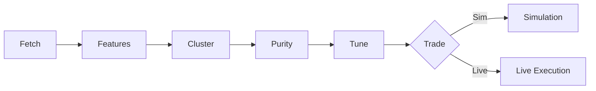

# WindowSurfer

> Crypto trading research bot with a single guiding law: **Sim-Live Parity**.

## Table of Contents
- [Overview](#overview)
- [Repository Layout](#repository-layout)
- [Setup](#setup)
- [Configuration](#configuration)
- [Data & Ledgers](#data--ledgers)
- [CLI Reference](#cli-reference)
- [Regimes Pipeline](#regimes-pipeline)
- [Tuning](#tuning)
- [Simulation & Live](#simulation--live)
- [Strategy Logic](#strategy-logic)
- [Logging & Debugging](#logging--debugging)
- [Troubleshooting](#troubleshooting)
- [Values & Ethos](#values--ethos)
- [FAQ & Glossary](#faq--glossary)
- [Change Log](#change-log)
- [Mini Audit](#mini-audit)

## Overview
WindowSurfer fetches hourly crypto candles, extracts features and clusters walk-forward blocks to discover market regimes. Tuned strategies are promoted to production only after passing a Sim vs Live parity audit.



See [system_contract.md](system_contract.md) for non‑negotiable safety constraints such as mandatory risk controls and the Sim‑Live parity audit.

## Repository Layout
```
WindowSurfer/
├─ bot.py                # CLI entrypoint
├─ systems/              # Engines and utilities
│  ├─ data_loader.py     # Candle fetching & cleaning
│  ├─ features.py        # 17 block‑level features
│  ├─ regime_cluster.py  # K‑Means clustering
│  ├─ regime_tuner.py    # Optuna search over pure blocks
│  ├─ sim_engine.py      # Shim to locate simulation backend
│  └─ paths.py           # Common data/ledger paths
├─ scripts/
│  └─ migrate_layout.py  # Misc utilities
├─ data/                 # Cached candles, brains, results, logs
└─ settings.json         # Path & clustering defaults
```
Historical strategy math lives under `scripts/legacy/` in the full project and serves as the canonical reference for new `systems/scripts/*` modules.

## Setup
1. **Python**: 3.11+ recommended.
2. **Virtual environment**
    ```bash
    python -m venv .venv
    source .venv/bin/activate
    pip install -r requirements.txt
    pip install ccxt  # required for exchange access
    ```
3. Works on Windows and Linux. Use `/` path separators and consider a wide terminal (long log lines).
4. `ccxt` handles exchange connectivity. Symbol mapping is resolved via `resolve_ccxt_symbols(...)` using names in `settings.json`; no Kraken pair mangling is required【F:bot.py†L68-L75】.
5. Place any API keys in an `.env` file or your shell environment as needed.

## Configuration
`settings.json` provides path defaults and clustering tweaks:
```jsonc
{
  "paths": {
    "data_root": "data",
    "raw_dir": "data/raw",
    "temp_dir": "data/temp",
    "brains_dir": "data/brains",
    "results_dir": "data/results",
    "logs_dir": "data/logs"
  },
  "cluster_settings": {
    "drop_features": ["avg_volume"],
    "replace_features": {},
    "std_floor": 1e-6
  }
}
```
*(excerpt from `settings.json`)*【F:settings.json†L1-L15】

Additional production deployments extend this file with:
- **ledger_settings**: per‑symbol tags, `kraken_name`, `binance_name`, and window sizes.
- **regime_settings**: default walk‑forward window lengths (`train`, `test`, `step`), feature list, K, seed, hysteresis and blending weights.
- **strategy knobs**: `position_pct`, `max_concurrent`, cooldowns, stops, take‑profit and trailing‑stop limits.
Simulation honors the same knobs and cooldown logic used by live trading.

## Data & Ledgers
- **Candles** are cached under `data/raw/*.parquet`【b54ab6†L111-L136】 and auto‑cleaned to enforce 1 h spacing【b54ab6†L32-L61】.
- **Simulation ledgers** are written to `data/tmp/simulation/` and cleared before new runs.
- **Live ledgers** persist in `ledger/<TAG>/` (one directory per asset).
- Ledger entries record buys and closes; when enabled, the bot refuses to sell at a loss.

## CLI Reference
### Top Level
```bash
python bot.py -h
```
```
usage: bot.py [-h] {data,regimes,audit,brain} ...
```
Commands: `data`, `regimes`, `audit`, `brain`【30ada1†L1-L11】

### Regimes Subcommand
```bash
python bot.py regimes -h
```
```
usage: bot.py regimes [-h] --action {train,assign,audit,tune} ...
```
Sub‑steps: `plan`, `features`, `cluster`, `purity`【1470af†L1-L24】

Common options:
- `--tag SOLUSDT`
- `--run-id regimes_fresh`
- `-v/-vv/-vvv` for verbosity

## Regimes Pipeline
A typical SOLUSDT run uses a 3 w train (504 candles), 1 m test (720), and 1 m step, yielding ~60 blocks.
1. **Plan**: `bot.py regimes plan --tag SOLUSDT --run-id regimes_fresh -v`.
2. **Features**: extracts 17 metrics; zero‑variance columns are dropped automatically【F:systems/features.py†L21-L39】【F:systems/features.py†L222-L233】.
3. **Cluster**: K‑Means with K=3, seed=2; artifacts include assignments and centroids【F:systems/regime_cluster.py†L41-L83】.
4. **Purity**: compute τ‑purity; e.g., {R0:22, R1:1, R2:9} at τ=0.70.
5. **Tune**: target regime’s pure blocks only.

## Tuning
Objective maximizes `pnl_dd = pnl * (1 - 1.5 * maxdd)` and rejects trials with fewer than 10 trades【F:systems/regime_tuner.py†L156-L205】.
Example smoke run:
```bash
python bot.py regimes --action tune --tag SOLUSDT --run-id regimes_fresh \
  --regime-id 0 --tau 0.70 --trials 3 -vv
```
A full search uses `--trials 80`. Ranges for R0:
- `position_pct` 0.02‑0.12
- `max_concurrent` 1‑3
- `buy_cooldown` 4‑18
- `rsi_buy` 30‑45
- `take_profit` 0.008‑0.035
- `trailing_stop` 0.006‑0.03
- `stop_loss` 0.02‑0.08
- `sell_cooldown` 3‑16
Artifacts are written to `data/regimes/{run-id}/tuning/{tag}/R{regime}/` (leaderboard.csv, best.json)【F:systems/regime_tuner.py†L223-L239】. Use `--write-seed` to promote the best knobs into `regimes/seed_knobs.json`【F:systems/regime_tuner.py†L242-L253】.

## Simulation & Live
`systems/sim_engine.py` loads the production simulation backend to maintain parity with live execution. Live execution runs hourly and reuses the same decision path as simulation, sharing cooldowns, order sizing and exchange minimum checks. Ledgers persist across runs and are appended atomically.

### Run a Plain Simulation
```bash
python -c "from systems.sim_engine import run_sim_blocks; ..."  # example skeleton
```

## Strategy Logic
Feature extraction and regime clustering power higher‑level strategies. Individual entry/exit functions (`evaluate_buy`/`evaluate_sell`) live under `systems/scripts/` and delegate math to `scripts/legacy/` (read‑only reference). Execution occurs via `execute_buy`/`execute_sell`, keeping evaluation and execution separate.

## Logging & Debugging
- `-v/-vv/-vvv` increases verbosity.
- Logs are tee’d to `data/logs/regimes_<TAG>_<RUN_ID>.log`【F:systems/paths.py†L21-L63】.
- Enable `-vv` to show window positions and per‑block summaries.

## Troubleshooting
- **“No pure blocks”** → lower `--tau`.
- **“No trades”** → expand search space or relax gates.
- **ccxt symbol errors** → verify `kraken_name`/`binance_name` mappings in config and ensure `resolve_ccxt_symbols` is working【30b971†L68-L75】.
- **Empty data window** → run `bot.py data fetch-history` for the tag.

## Values & Ethos
WindowSurfer is built on humility: slow, verifiable improvements and defensive programming. The Sim‑Live parity audit is mandatory before promoting configs; no strategy is trusted until simulation results mirror live performance.

## FAQ & Glossary
- **Block**: walk‑forward train/test slice.
- **Purity τ**: fraction of candles in a block predicted as a regime.
- **K**: number of clusters/regimes.
- **PnL**: profit and loss.
- **MaxDD**: maximum drawdown.
- **R0/R1/R2**: regime identifiers.
- **Knobs**: tunable strategy parameters.
- **Why `pnl_dd`?** Penalizes drawdown to avoid brittle high‑PnL, high‑risk solutions.

## Change Log
- _2024‑06‑XX_: Initial Codex documentation drop. Update this section when CLI or paths change to avoid doc rot.

## Mini Audit
- `python bot.py -h`
- `python bot.py regimes -h`
- Attempted to install `ccxt` (network blocked)

